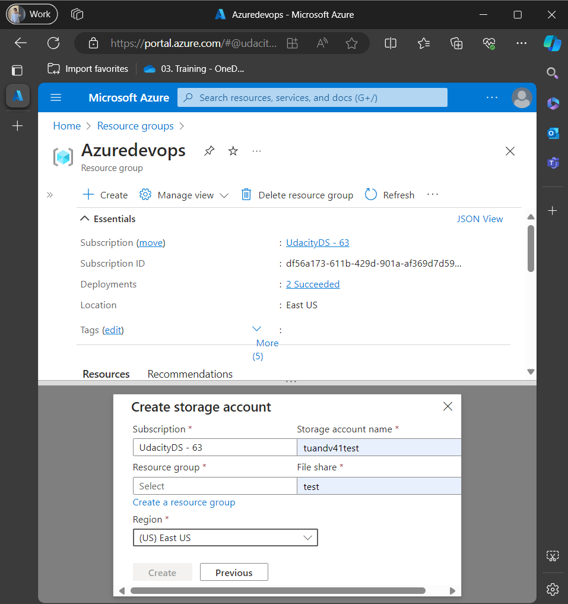
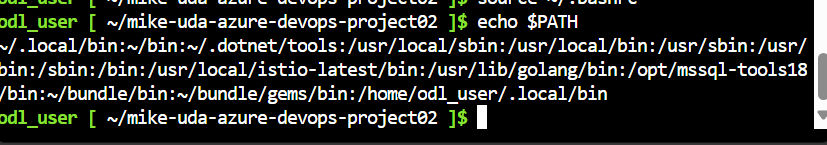
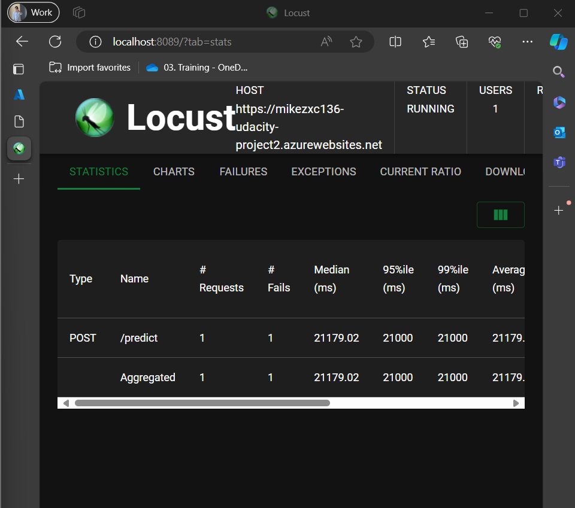

[](https://github.com/mikezxc136/mike-uda-azure-devops-project02/actions/workflows/python-app.yml)

# Overview

The architecture can be found in the image below:


## Project Plan

* [Trello board](https://trello.com/b/EK2iO0mA/mike-project2)
* [Project plan](https://1drv.ms/x/s!Ap6lZbK3PEB_mk3rQWBhgkWiEjkH?e=KAn9Ki)

## Cloud Shell Configuration

1. **Create new Storage Account** with a unique name in the same region as the existing resource group.
   
2. Follow the instructions at [adding-a-new-ssh-key](https://docs.github.com/en/authentication/connecting-to-github-with-ssh/adding-a-new-ssh-key-to-your-github-account) to add a public key to your GitHub Account.

   Alternatively, you can follow these steps:

   * Generate key:
     ```bash
     ssh-keygen -t rsa -b 4096 -C "your_email@example.com"
     ```
   * Import the SSH Public Key to GitHub:
     ```bash
     cat ~/.ssh/id_rsa.pub
     ```
   * Check GitHub connection:
     ```bash
     ssh -T git@github.com
     ```
3. Import the path to the environment:

   * Open `.bashrc` by:
     ```bash
     nano ~/.bashrc
     ```
   * Add the following line to the end of the file:
     ```bash
     export PATH=$PATH:/home/odl_user/.local/bin
     ```
   * Save by pressing `Ctrl+X`, then `Y`, and `Enter`.
   * Check the path environment:
     ```bash
     source ~/.bashrc
     ```

     
4. Clone the repository into Cloud Shell using the SSH URL.
   

   * The result should look like this:
     
5. In Cloud Shell, run:

   ```bash
   make all
   ```

   
6. Run the command:

   ```bash
   sh commands.sh
   ```

   This will set up the Azure pipeline and App Service.
7. Clone the repository to your local machine (use either HTTPS or SSH).
8. Verify the project is running on Azure App Service.

   * By browser:
     
   * Output of streamed log files from the deployed application:
     
9. Run the following commands (you can change the command based on your OS; for my case, it is Windows):

   ```shell
   python -m venv .
   source Scripts/activate
   python.exe -m pip install --upgrade pip
   pip install --upgrade pip && pip install -r requirements.txt
   ```
10. Start `locust` in your local environment by running the command:

    ```bash
    locust -f locustfile.py --host=https://mikezxc136-udacity-project2.azurewebsites.net
    ```

    The result should look like this:
    
11. Open another terminal, navigate to the repository folder, and run:

    ```bash
    sh make_predict_azure_app.sh
    ```

    The result should look like this:
    
12. Open a browser and go to:

    ```bash
    http://localhost:8089/?tab=stats
    ```



## Configure Azure Pipeline Agent

1. Open a new tab for [Azure DevOps](https://aex.dev.azure.com).
2. Set up your DevOps organization, a project, and a service connection.
3. Create a Personal Access Token (PAT) with "Full access" permission. Store the token securely.
4. Create a new pool named `mypool` as a `Self-hosted` type.
5. Open the newly created Agent pool to add a new agent, select `Linux x64`, and copy the download link.
   
6. Open "Virtual machine" service, search for the VM named `my-agent-1`, and copy the Public IP address.
7. Connect to the VM by running:

   ```bash
   ssh devopsagent@<IP_in_Step_6>
   ```

   Type `DevOpsAgent@123` as the password (Note that the password will not show during input).

   * Install Docker in the agent:

     ```bash
     sudo snap install docker
     sudo groupadd docker
     sudo usermod -aG docker $USER
     ```
   * Install Python v3.9:

     ```bash
     sudo apt-get update
     sudo apt update -y
     sudo apt install software-properties-common
     sudo add-apt-repository ppa:deadsnakes/ppa
     sudo apt install python3.9 -y
     sudo apt-get install python3.9-venv -y
     sudo apt-get install python3-pip -y
     python3.9 --version
     pip --version
     sudo apt-get install python3.9-distutils
     sudo apt-get -y install zip
     ```
   * Pylint configuration:

     ```bash
     pip install pylint==2.13.7
     pip show --files pylint
     echo $PATH
     export PATH=$HOME/.local/bin:$PATH
     echo $PATH
     which pylint
     ```
   * Install the pipeline agent:

     ```bash
     curl -O https://vstsagentpackage.azureedge.net/agent/3.240.1/vsts-agent-linux-x64-3.240.1.tar.gz
     mkdir myagent && cd myagent
     tar zxvf ../vsts-agent-linux-x64-3.240.1.tar.gz
     ./config.sh
     ```
   * Provide your Azure DevOps organization URL, for example:

     ```bash
     https://dev.azure.com/odluser260513
     ```
   * Use the Personal Access Token from Step 3.
   * Set the agent pool to `mypool`.
   * Keep the default settings for other configurations.

   

   * Run the following commands to finish the setup:

     ```bash
     sudo ./svc.sh install
     sudo ./svc.sh start
     ```
   * Verify the agent status in "Agent Pool":
     
8. Back to the project page, add a new environment named `Flask`.
9. Use the service principal information to create a new service connection named `mikezxc-project2` and grant full access.
10. Make changes and push them to your repository.

    * Passing tests that are displayed after running the `make all` command from the `Makefile`:
      
    * Successful deployment of the project in Azure Pipelines.
    * Running Azure App Service from Azure Pipelines automatic deployment.

## Demo

[My Demo](https://www.youtube.com/watch?v=hhIYuIIPthY)
