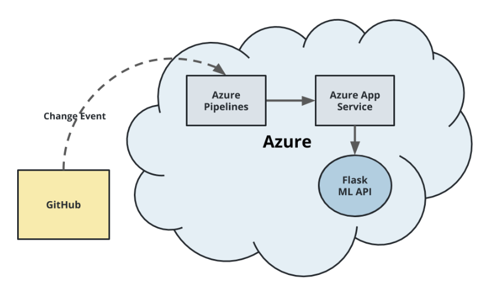

[](https://github.com/caonguyen207/uda-azure-devops-project02/actions/workflows/python-app.yml)

# Overview

By this repository, you will learn how to use Azure pipeline to deploy sample Machine Learning application in Azure App Service. The architecture can be found by below image:



## Project Plan

* [Trello board for the project](https://trello.com/b/wDMvjqUG)
* [Project plan](https://docs.google.com/spreadsheets/d/1du_E_xeAR8mFBBxwhbhLPoOV3wZG-gVc/edit?usp=sharing&ouid=110340001021106604897&rtpof=true&sd=true)

## Getting Started

### Cloud Shell Configuration

1. Create new Storage Account with unique name in same region with existing resource group.


2. Follow instruction at [adding-a-new-ssh-key-to-your-github-account](https://docs.github.com/en/authentication/connecting-to-github-with-ssh/adding-a-new-ssh-key-to-your-github-account) and add public key to your Git Hub Account.
3. Clone the repo into Cloud Shell use SSH URL.


* The result should be as below


4. In cloud shell, run `make all`


5. Run the command `sh commands.sh` for Azure pipeline and App Service creation.
6. Clone the repo into local laptop/desktop (use either HTTPs or SSH)
7. Verify project running on Azure App Service.


* By browser:


* By CMD:


* Output of streamed log files from deployed application


8. Run below command (you can change the command based on your OS, for my case is Window)

```shell
python -m venv .
source Scipts/active
python.exe -m pip install --upgrade pip
pip install --upgrade pip && pip install -r requirements.txt
```

9. Start `locust` in your local environment by running command: `locust -f locustfile.py --host=https://nguyenlc1-project2.azurewebsites.net`. The result should be as below.


10. Open another terminal, navigate to repo folder and run:  `sh make_predict_azure_app.sh`. The result should be as below.


11. Open browser and paste: `http://localhost:8089/?tab=stats`, it should display testing result as below:


### Configure Azure Pipeline Agent

1. Navigate to browser that now logged in with Azure account.
2. Open new tab and paste [Azure DevOps](https://aex.dev.azure.com).
3. DevOps org, a project and Service connection.
4. Create a Personal Access Token (PAT) with "Full access" permission. You need store the token in secure place.
5. Go to "Project settings" on bottom-left conner, select  "Agent pools" and create new pool named `mypool` as `Self-hosted` type.
6. Open the newly created Agent pool to add a new agent, select `Linux x64` and copy the download link.


7. Open "Virtual machine" service, search by name `my-agent-1` and copy Public IP address.
8. Connect to the VM by running command `ssh devopsagent@<IP_in_Step_7>`. Typing `DevOpsAgent@123` as password (Please note that password will not show during keyin time)

* Install docker in the agent.

```shell
sudo snap install docker
sudo groupadd docker
sudo usermod -aG docker $USER
```

* Install python v3.9

```shell
sudo apt-get update
sudo apt update -y
sudo apt install software-properties-common
sudo add-apt-repository ppa:deadsnakes/ppa
sudo apt install python3.9 -y
sudo apt-get install python3.9-venv -y
sudo apt-get install python3-pip -y
python3.9 --version
pip --version
sudo apt-get install python3.9-distutils
sudo apt-get -y install zip
```

* Pylint configuration

```shell
pip install pylint==2.13.7
pip show --files pylint
echo $PATH
export PATH=$HOME/.local/bin:$PATH
echo $PATH
which pylint
```

* Install the pipeline agent

```shell
curl -O https://vstsagentpackage.azureedge.net/agent/3.234.0/vsts-agent-linux-x64-3.234.0.tar.gz (Replace by the link copied in step 6.)
mkdir myagent && cd myagent
tar zxvf ../vsts-agent-linux-x64-2.202.1.tar.gz
./config.sh
```

* Server URL: Provide your Azure DevOps organization URL, ex: `https://dev.azure.com/odluser193422`
* Personal access token: `Use value in step 4 above`
* Agent pool: `mypool`
* Keep as default for other configuration.


* Run the following commands to finish the set up.

```shell
sudo ./svc.sh install
sudo ./svc.sh start
```


* Verify agent status in "Agent Pool"


9. Back to project page and add new environment named `Flask`.
10. User service principal information and create new service connection with named `nguyenlc1-project2`, remember to grant full access.
11. Make the change and push the change to your Repo.

* Passing tests that are displayed after running the `make all` command from the `Makefile`


* Successful deploy of the project in Azure Pipelines.

* Running Azure App Service from Azure Pipelines automatic deployment

## Enhancements

* Should allow to use specified python version in pipeline configuration instead of `hardcode` version in agent build.

## Demo

[My Demo](https://youtu.be/pwqhyhGGiWY)
